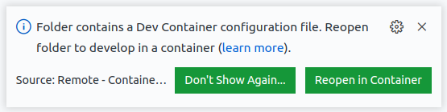
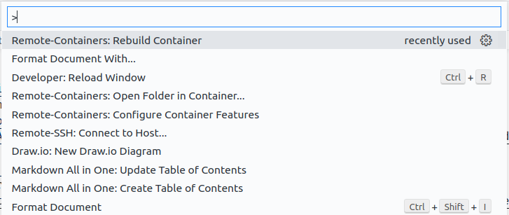
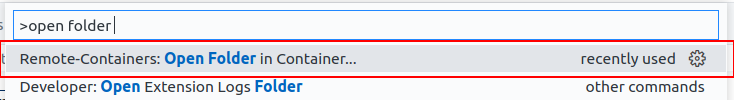

# Devontainer Template

Small devcontainer template with some quality of life tools and extensions already installed.

# Installation

## Prerequisites:

1. Docker:
   - [Install on Windows](https://docs.docker.com/desktop/windows/install/)
   - Install on Linux:
     - [Official Docker Documentation](https://docs.docker.com/engine/install/)
     - [Some Blog Article for Ubuntu](https://www.linux.com/topic/desktop/how-install-and-use-docker-linux/)
2. VSCode:
   - [Installation (crossplatform)](https://code.visualstudio.com/Download)
3. Remote Containers Extension for VSCode:
   - https://marketplace.visualstudio.com/items?itemName=ms-vscode-remote.remote-containers

## Steps to set up

1. If you have the remote-container extension installed and open this repository in vscode, this prompt will show up, asking you if you want to open the folder in a container. Click `Reopen in Container` and wait until the container finished building

    

  - 1.1 If the prompt didn't show up, you can manually open the folder in a container by using `CTRL` + `SHIFT` + `P`, until the vscode command prompt shows up. In there, search for "Open folder in Container"
      
      


  - 1.2 If your terminal looks like this after the container started:

    

    you are missing the `Meslo LGS NF` Font on your Computer. You can install it ...
      - ... on Linux:

        by running this [script](./.devcontainer/fonts/install_fonts.sh) with the "install" argument:
          ```bash
          cd .devcontainer/fonts && ./install_fonts.sh install
          ```
          > If this doesn't work, you can also manually open the files in [fonts](./.devcontainer/fonts/) and click "install"
      - ... on Windows:

        by opening these files and clicking "install":
        - [Meslo Regular](./.devcontainer/fonts/MesloLGSNFRegular.ttf)
        - [Meslo Bold Italic](./.devcontainer/fonts/MesloLGSNFBoldItalic.ttf)
        - [Meslo Italic](./.devcontainer/fonts/MesloLGSNFItalic.ttf)
        - [Meslo Bold](./.devcontainer/fonts/MesloLGSNFBold.ttf)